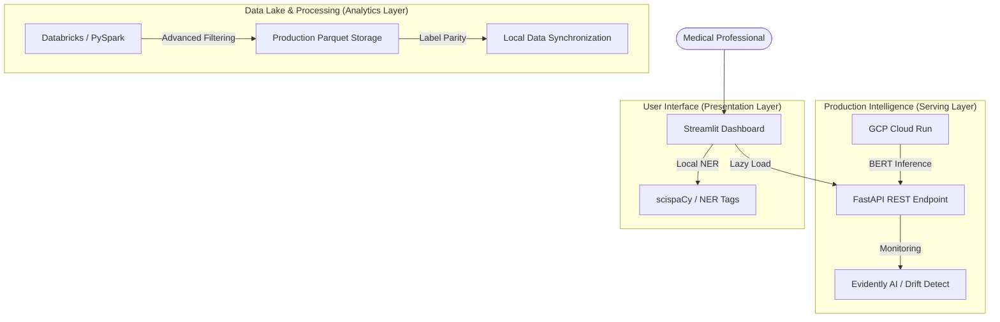

<p align="center">
  
</p>

<h1 align="center">🏥 ClinSense</h1>
<p align="center">
  <strong>Production-Grade Clinical Text Intelligence & Data Synchronization</strong>
</p>

<p align="center">
  
  
  
  
</p>

---

## 🏗️ Enterprise Infrastructure

ClinSense is built for a production-first environment, utilizing a hybrid cloud architecture that separates high-scale data preprocessing from real-time intelligence.



### 🔐 Data Governance & Parity logic
A core feature of the current infrastructure is the **strict logic synchronization** between the Databricks production pipeline and the local training/inference code.

- **Unified Filters**: Minimum 150 samples per class, minimum 100 average word count.
- **Label Alignment**: Hardcoded specialty mapping (8 classes) ensures that Databricks output always matches the BERT model's `id2label` requirements.
- **Verification**: `scripts/diagnose_data.py` serves as the audit tool to verify parity between CSV/local and Parquet/Databricks data formats.

---

## 🎯 Production Specialties
ClinSense provides high-confidence classification for the following 8 medical specialties, synchronized end-to-end:

1.  **Cardiovascular / Pulmonary**
2.  **Gastroenterology**
3.  **Neurology**
4.  **Obstetrics / Gynecology**
5.  **Orthopedic**
6.  **Radiology**
7.  **SOAP / Chart / Progress Notes**
8.  **Urology**

---

## ⚡ Quick Start

### 1. Environment Setup
```bash
git clone https://github.com/isakshay007/ClinSense.git
cd ClinSense
python -m venv venv
source venv/bin/activate
pip install -r requirements.txt
```

### 2. Verify Data Parity
Run the diagnostic script to ensure your local sample distribution matches production standards:
```bash
python scripts/diagnose_data.py
```

### 3. Launch UI (Linked to GCP)
```bash
streamlit run app/streamlit_app.py
```

---

## � Deployment

### GCP Cloud Run
ClinSense is optimized for serverless deployment on GCP. The infrastructure is defined in `gcp/cloud-run.yaml` with specific resource allocations for BERT (4GiB RAM, 2 vCPU).

```bash
# Deploy to Production
./scripts/deploy_gcp.sh
```

### Integration Test
Verify the live API health and prediction accuracy:
```bash
python scripts/test_api_v2.py --url https://your-cloud-run-url.run.app
```

---

## 📊 Performance Metrics

| Model | Micro F1 | Macro F1 | Status |
| :--- | :--- | :--- | :--- |
| **Fine-tuned BERT** | **71.1%** | **70.1%** | **Production** |
| TF-IDF + Logistic Reg | 67.9% | 68.3% | Baseline |
| TF-IDF + SVM | 65.9% | 66.3% | Baseline |

---

## 📁 Repository Structure
```text
ClinSense/
├── databricks/
│   └── preprocess_pipeline.py # Production PySpark Pipeline
├── app/
│   ├── streamlit_app.py      # Optimized Medical Dashboard
│   └── main.py               # FastAPI GCP Endpoint
├── scripts/
│   ├── deploy_gcp.sh         # CI/CD deployment logic
│   ├── diagnose_data.py      # Data Audit & Parity Tool
│   └── test_api_v2.py        # E2E Production Verification
├── src/
│   ├── services/predictor.py  # BERT Inference Engine
│   └── data/loader.py         # Synced Data Preprocessing
└── config/
    └── config.yaml           # Master Config (Parity Constants)
```

---

<p align="center">
  Developed for Enterprise Clinical Intelligence • 2026
</p>
